# Movie Finder


## ตารางเนื้อหา
1. [การออกแบบ](#การออกแบบ)
2. [รายละเอียดโปรเจค](#รายละเอียดโปรเจค)
3. [ฟีเจอร์](#ฟีเจอร์)
4. [การติดตั้งและใช้งาน](#การติดตั้งและใช้งาน)
5. [ภาพตัวอย่าง](#ภาพตัวอย่าง)
6. [ลิ้งค์วิดีโอ](#ลิ้งค์วิดีโอ)
7. [สมาชิกในกลุ่ม](#สมาชิกในกลุ่ม)

## การออกแบบ
ลิ้งค์การออกแบบตัว ui สำหรับ prototype ต้นแบบของแอปพลิเคชั่นนี้เปิดได้ที่ [Figma](https://www.figma.com/design/ufVhM2TXOv6bg7LHA0FjE6/Movie-Finder---Prototype-?node-id=0-1&t=LncuSNaZ38SaEcjb-1)

## รายละเอียดโปรเจค
โปรเจคนี้เป็นส่วนหนึ่งของวิชา Mobile Application Design and Development รหัสวิชา 01418342 พวกเราได้ทำการพัฒนา Android Application โดยใช้ภาษา Kotlin และ Jetpack Compose UI ในการพัฒนาแอปพลิเคชั่นแล้วมีการเชื่อมต่อฐานข้อมูลแบบ NoSQL 
อย่าง Firebase Firestore ใช้ในการเก็บข้อมูลและดำนำการ CRUD Operations ภายในแอปพลิเคชั่น เกี่ยวกับแอปพลิเคชั่นนี้ เป็นแอปหาดูรายการหนังภาพยนตร์ออนไลน์ โดยแบ่งเป็นฟีเจอร์หลักๆดังนี้

---

## ฟีเจอร์
- ดูข้อมูลหนังภาพยนตร์ทั้งหมด
- ดูข้อมูลรายละเอียดหนังภาพยนตร์
- ระบบสมัครสมาชิกและการเข้าสู่ระบบด้วย Email, Google และ Github
- การแก้ไขรหัสผ่านของบัญชีที่ผูกกับบัญชี Email
- ระบบค้นหาชื่อหนังภาพยนตร์
- ระบบการกดไลค์ชอบหนังภาพยนตร์
- การเก็บประวัติการเข้าชม
- ดูข้อมูลโปรไฟล์ผู้ใช้งาน
- ลบบัญชีผู้ใช้งาน

---

## การติดตั้งและใช้งาน

1. ใช้คำสั่ง git clone ในการติดตั้งโปรเจค
```
git clone https://github.com/WarinCode/movie-finder.git
```

2. เปิด Android Studio แล้วเปิดโฟลเดอร์ชื่อ `movie-finder`
3. ทำการกด build ตัวโปรเจค
4. เมื่อ build เสร็จทำการกดรัน
5. จะเจอหน้าแอปพลิเคชั่นเพื่อใช้งาน

---

## ภาพตัวอย่าง

<p>หน้า Sign In</p>
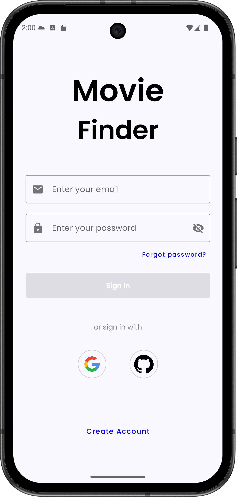

<br/>

<p>หน้า Sign Up</p>


<br/>

<p>หน้า Home</p>
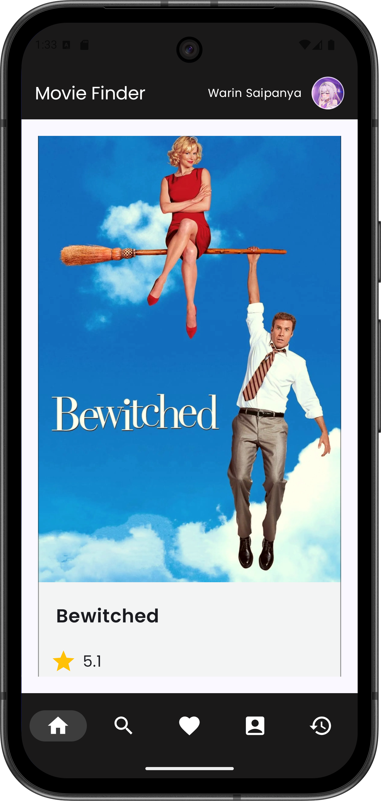

<br/>

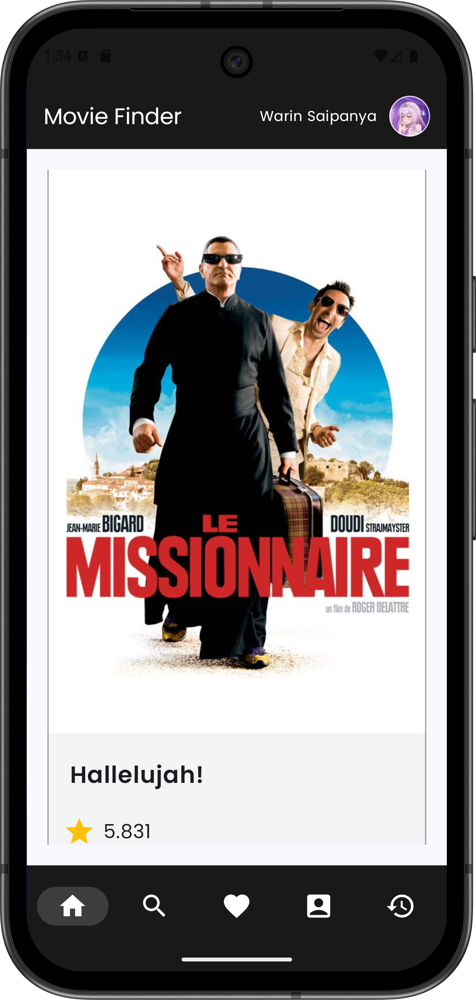

<br/>

<p>หน้าแสดงรายละเอียดหนัง</p>
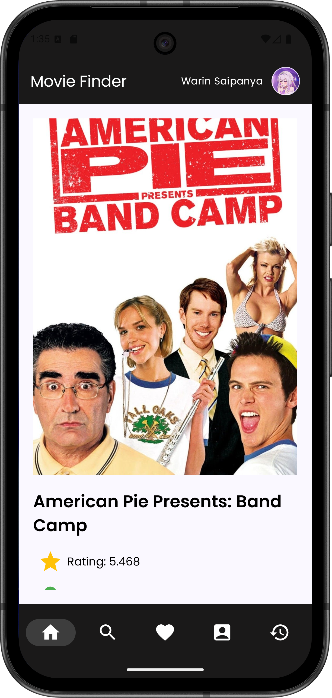

<br />

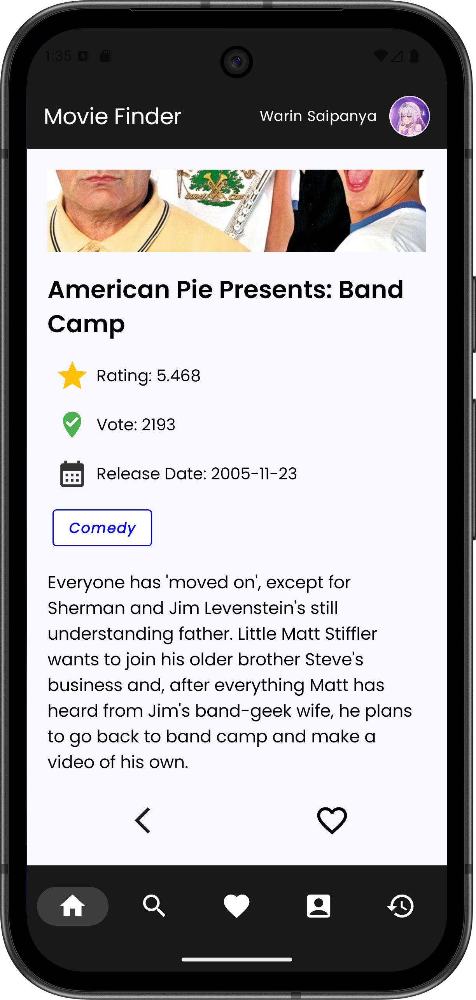

<br/>

<p>การกกดไลค์</p>
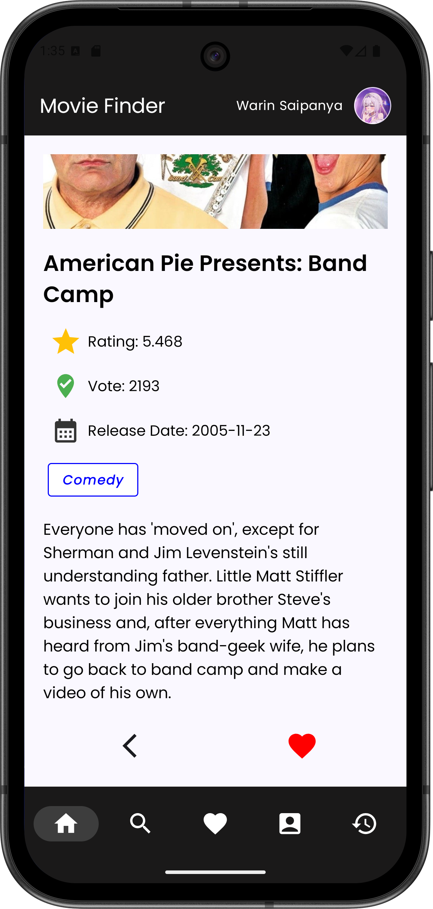

<br />

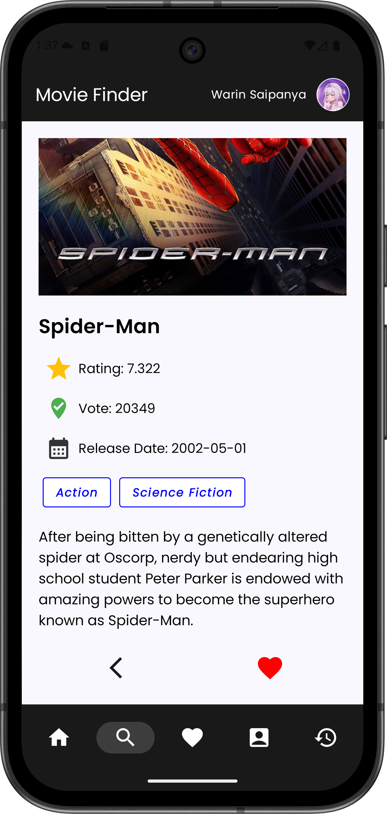

<br />

<p>หน้าแสดงการกดไลค์</p>

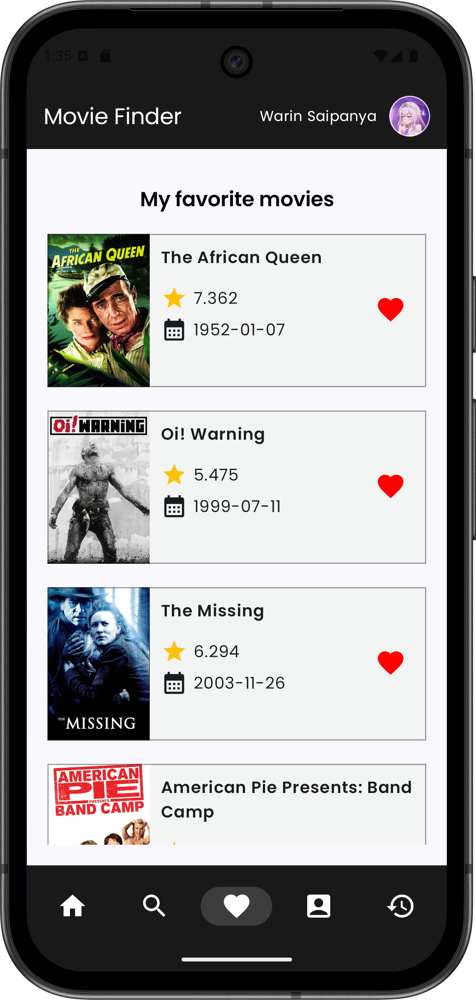

<br />

<p>หน้าค้นหาหนัง</p>

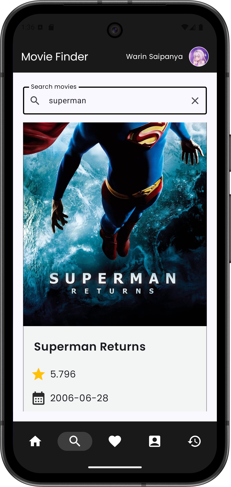

<br />

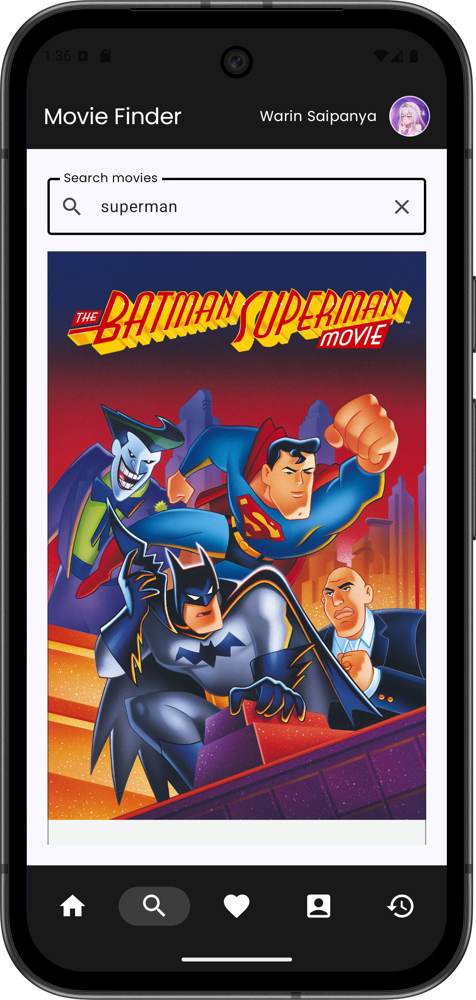

<br />

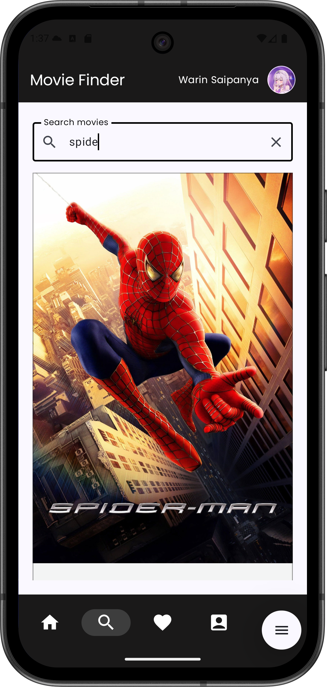

<br />

<p>หน้าประวัติการเข้าชม</p>

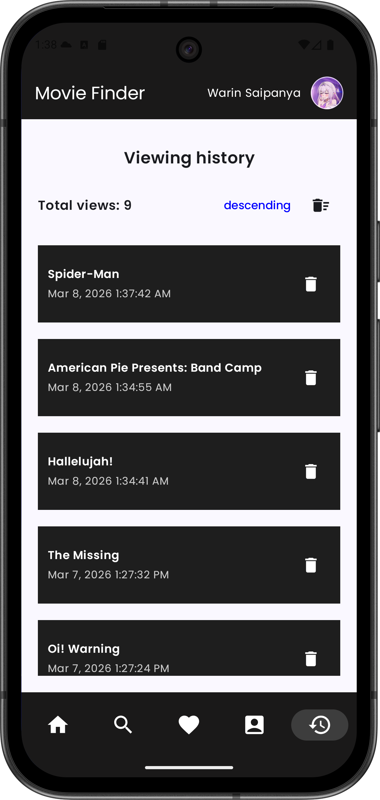

<br />

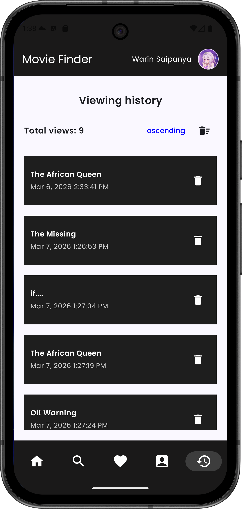

<br />

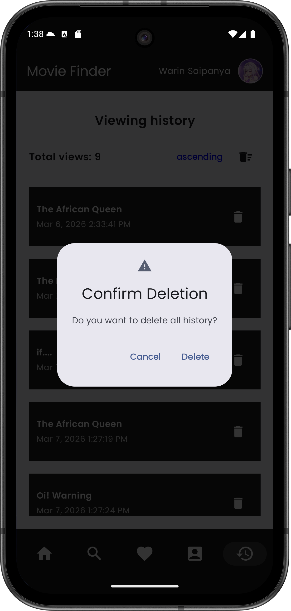

<br />

<p>หน้าโปรไฟล์ผู้ใช้งาน</p>

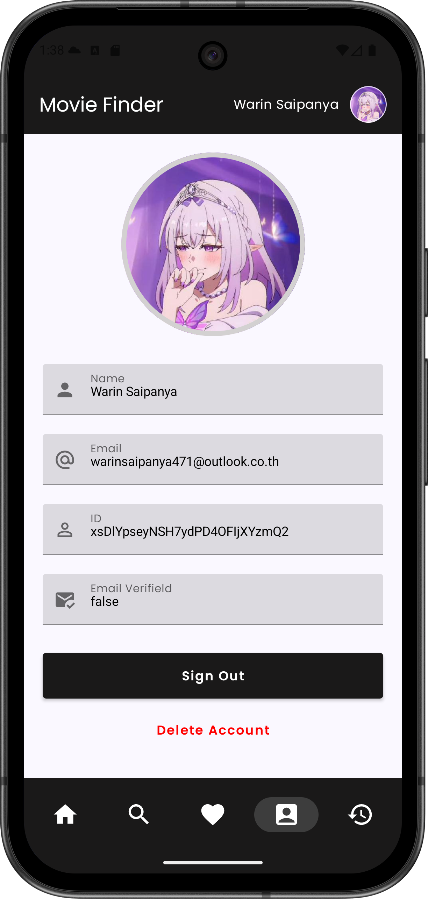

<br />

---

## ลิ้งค์วิดีโอ
ดูตัวอย่างการใช้งานแอปพลิเคชั่นได้ที่ลิ้งค์นี้ [Google Drive](https://drive.google.com/drive/folders/17cmtdSybfp7wyx2RmmWhwzwDWoB4J5HQ?usp=sharing)

---

## สมาชิกในกลุ่ม
1. นาย ปัณณวัฒน์ นิ่งเจริญ รหัสนิสิต 6630250231
2. นาย พันธุ์ธัช สุวรรณวัฒนะ รหัสนิสิต 6630250281
3. นาย วรินทร์ สายปัญญา รหัสนิสิต 6630250435
4. นาย ปุณณภพ มีฤทธิ์ รหัสนิสิต 6630250591